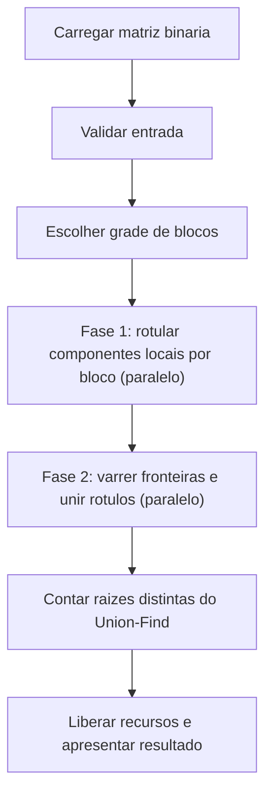
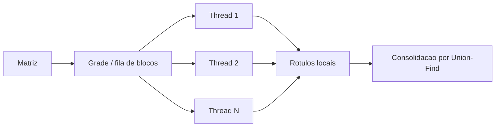

# Relatório técnico - Contagem paralela de objetos em uma matriz binária

> **Disciplina:** Sistemas Operacionais - 2026/II
> **Professor:** Prof. Filipo Novo Mór
> **Instituição:** Pontifícia Universidade Católica do Rio Grande do Sul - Escola Politécnica
> **Repositório:** <https://github.com/erickcarpes/T1-Sisop>
> **Versão:** 2.0
> **Data:** [06/10/2026]

## Identificação

| Campo | Informação |
|---|---|
| Integrante 1 | Augusto Ely Missiaggia |
| Matrícula do integrante 1 | [22106086] |
| Integrante 2 | Erick Marcondes de Mattos Carpes |
| Matrícula do integrante 2 | [24106430] |
| Modalidade | Dupla |
| Turma | [330] |
| Estratégia paralela | Pthreads (threads POSIX) |
| Plataforma testada | Linux (Ubuntu 24.04.4 LTS, x86_64) |

## Resumo

Este trabalho resolve a contagem de objetos em uma matriz binária com
**conectividade 8**, na qual duas células de valor `1` pertencem ao mesmo
objeto quando estão conectadas por lado **ou** por diagonal. A versão
sequencial percorre a matriz linha a linha e, a cada célula `1` ainda não
visitada, inicia um *flood fill* iterativo com **pilha explícita** que marca
todo o componente. A versão paralela, baseada em **Pthreads**, divide a matriz
em uma grade de blocos retangulares (cerca de quatro blocos por thread), rotula
os componentes locais de cada bloco em paralelo e, em seguida, varre as
fronteiras entre blocos para unir rótulos equivalentes com um **Union-Find**
protegido por mutex; o resultado final é o número de raízes distintas. As cinco
matrizes obrigatórias e um teste diferencial aleatório não apresentaram
divergência entre as versões. Na matriz 5000 x 5000 a aceleração chegou a
**2,56x** com 12 threads, limitada por banda de memória, pela parcela serial de
consolidação e pelo hardware de teste.

**Palavras-chave:** sistemas operacionais; paralelismo; threads; conectividade 8; flood fill; componentes conexos.

## 1. Visão geral do problema

O programa recebe uma matriz binária na qual `0` representa o fundo e `1`
representa o primeiro plano. Um objeto corresponde a um componente de células de
valor `1` conectadas horizontalmente, verticalmente ou diagonalmente, conforme a
**conectividade 8**.

O projeto contém duas implementações funcionalmente equivalentes:

1. uma versão sequencial, usada como referência de correção e de desempenho;
2. uma versão paralela baseada em **threads POSIX (Pthreads)**.

### 1.1 Objetivos da implementação

- Contar corretamente os objetos com conectividade 8.
- Distribuir trabalho efetivo entre pelo menos duas unidades de execução.
- Reconhecer e unificar objetos que atravessam as divisões da matriz.
- Produzir resultados determinísticos e idênticos nas versões sequencial e paralela.
- Evitar condições de corrida, deadlocks, atualizações perdidas e contagens duplicadas.
- Avaliar correção, sobrecarga, escalabilidade, aceleração e eficiência.

### 1.2 Requisitos atendidos

| Requisito | Como foi atendido | Evidência no repositório |
|---|---|---|
| ANSI C C89/C90 | Compilação com `-std=c89 -Wall -Wextra -pedantic` | [`Makefile`](Makefile) |
| Conectividade 8 | Vetores de deslocamento com 8 direções | [`src/sequencial.c:18`](src/sequencial.c), [`src/paralelo.c:107`](src/paralelo.c) |
| Versão sequencial | Um único fluxo de controle, referência de correção | [`src/sequencial.c`](src/sequencial.c) |
| Versão paralela | Threads POSIX com duas fases paralelas | [`src/paralelo.c`](src/paralelo.c) |
| Duas ou mais unidades concorrentes | `./bin/paralelo tests/exemplo1.txt 4` imprime `threads: 4` | [`src/paralelo.c:553`](src/paralelo.c) |
| Quantidade configurável de trabalhadores | Segundo argumento de linha de comando, mínimo 1 | [`src/paralelo.c:421`](src/paralelo.c) |
| Consolidação entre regiões | Varredura de fronteiras + Union-Find | [`src/paralelo.c:216`](src/paralelo.c) |
| Tratamento horizontal, vertical e diagonal | Deslocamentos `-1, 0, +1` nas duas varreduras | [`src/paralelo.c:247`](src/paralelo.c), [`src/paralelo.c:297`](src/paralelo.c) |
| Verificação das chamadas POSIX | Retornos de `pthread_create`/`join`/`mutex_*` verificados | [`src/paralelo.c:477`](src/paralelo.c) |
| Liberação dos recursos | `free`, `pthread_mutex_destroy`, `pthread_join` | [`src/paralelo.c:560`](src/paralelo.c), [`src/comum.c:23`](src/comum.c) |
| Compilação reproduzível | Alvo `make` único | [`Makefile`](Makefile) |

## 2. Organização do repositório

```text
.
├── README.md
├── Makefile
├── src/
│   ├── comum.h            tipos e utilidades compartilhados (matriz, pilha, relógio)
│   ├── comum.c            implementação de comum.h
│   ├── sequencial.c       versão sequencial de referência
│   ├── paralelo.c         versão paralela com Pthreads
│   └── gerar.c            gerador de matrizes para os testes de desempenho
├── scripts/
│   ├── testes.sh          valida as cinco matrizes obrigatórias
│   └── bench.sh           experimento de desempenho
├── tests/
│   ├── exemplo1.txt       matrizes obrigatórias do enunciado
│   ├── exemplo2.txt
│   ├── exemplo3.txt
│   ├── exemplo4.txt
│   └── exemplo5.txt
└── results/
    ├── desempenho_3000.txt  dados brutos (3000 x 3000, densidade 40%)
    └── desempenho_5000.txt  dados brutos (5000 x 5000, densidade 40%)
```

Artefatos locais ignorados pelo `.gitignore`: `bin/` (executáveis) e
`results/grande_*.txt` (matrizes grandes, regeneráveis com `bin/gerar`).

| Caminho | Finalidade |
|---|---|
| `src/comum.h` / `src/comum.c` | Tipos `Matriz`, `Posicao` e `Pilha`, leitura de matriz, pilha explícita e relógio monotônico. |
| `src/sequencial.c` | Implementação sequencial de referência. |
| `src/paralelo.c` | Implementação paralela (rotulagem + consolidação). |
| `src/gerar.c` | Gera matrizes aleatórias no formato lido pelas duas versões. |
| `scripts/testes.sh` | Compara sequencial e paralela com os valores esperados. |
| `scripts/bench.sh` | Mede tempo e aceleração com várias quantidades de threads. |
| `tests/exemplo{1..5}.txt` | Matrizes obrigatórias do enunciado. |
| `results/desempenho_*.txt` | Dados brutos das medições de desempenho. |

## 3. Ambiente de desenvolvimento e execução

### 3.1 Hardware e software

| Item | Especificação |
|---|---|
| Processador | 13th Gen Intel(R) Core(TM) i5-1335U |
| Núcleos físicos | 10 (2 de desempenho + 8 de eficiência) |
| Processadores lógicos | 12 |
| Memória RAM | 15 GiB |
| Sistema operacional | Ubuntu 24.04.4 LTS |
| Arquitetura | x86_64 |
| Compilador | GCC 13.3.0 (`cc`) |
| Padrão da linguagem | C89/C90 |
| APIs POSIX utilizadas | `pthread` (threads, mutex), `clock_gettime`, `fopen`/`fscanf` |
| Flags de compilação | `-std=c89 -Wall -Wextra -pedantic` e `-pthread` na versão paralela |

### 3.2 Compilação

```bash
make clean
make
```

O `Makefile` compila os três executáveis em `bin/` (`sequencial`, `paralelo` e
`gerar`) sem erros e sem avisos. Equivalentemente:

```bash
cc -std=c89 -Wall -Wextra -pedantic src/sequencial.c src/comum.c -o bin/sequencial
cc -std=c89 -Wall -Wextra -pedantic -pthread src/paralelo.c src/comum.c -o bin/paralelo
cc -std=c89 -Wall -Wextra -pedantic src/gerar.c -o bin/gerar
```

### 3.3 Execução

```bash
./bin/sequencial <arquivo-da-matriz>
./bin/paralelo  <arquivo-da-matriz> <numero-de-threads>
```

**Exemplo reproduzível:**

```bash
make
./bin/sequencial tests/exemplo1.txt
./bin/paralelo  tests/exemplo1.txt 4
```

Saída da versão sequencial:

```text
objetos: 3
tempo: 0.000021
```

Saída da versão paralela (inclui a grade de blocos e o tempo):

```text
objetos: 3
threads: 4
blocos: 4 x 4
tempo: 0.000701
```

Validação das cinco matrizes obrigatórias com 1, 2, 3, 4 e 8 threads:

```bash
make test
```

### 3.4 Formato da entrada e da saída

A matriz é lida de um arquivo texto: a primeira linha contém `linhas colunas` e
em seguida vêm `linhas * colunas` valores `0` ou `1`. O número de threads é
configurado pelo segundo argumento de `bin/paralelo` (inteiro positivo). A
leitura rejeita dimensões inválidas e valores diferentes de `0` ou `1`. A
versão paralela também informa a grade de blocos e o tempo medido; a contagem de
objetos é a mesma nas duas versões.

## 4. Arquitetura da solução

### 4.1 Fluxo geral



### 4.2 Estruturas de dados principais

| Estrutura | Tipo/representação | Responsabilidade | Compartilhada? | Proteção utilizada |
|---|---|---|---|---|
| Matriz de entrada | `Matriz` (`int linhas, colunas, *celulas`) | Armazenar `0` e `1` | Sim (somente leitura) | Não se aplica |
| Células visitadas (sequencial) | `int *visitado` | Distinguir células processadas | Não | Não se aplica |
| Rótulos locais | `int *rotulos` | Identificar cada componente local | Sim | Fase 1: escrita em blocos disjuntos; fase 2: somente leitura |
| Fila/pilha do flood fill | `Pilha` de `Posicao` | Percorrer um componente | Não (local por thread) | Não se aplica |
| Tarefas/regiões | grade + contador `proximo_bloco` | Distribuir blocos | Sim | `mutex_fila` |
| Equivalências de rótulos | `pai` e `altura` (Union-Find) | Consolidar componentes | Sim | `mutex_uniao` |
| Resultados locais | rótulos por bloco | Representar componentes antes da união | Sim | Consolidados na fase 2 |

## 5. Implementação sequencial

### 5.1 Algoritmo

A matriz é percorrida linha a linha. Ao encontrar uma célula `1` ainda não
visitada, inicia-se um novo objeto e executa-se um *flood fill* com uma **pilha
explícita** de posições `(linha, coluna)` — sem recursão. Cada célula `1` é
marcada como visitada **antes** de ser empilhada, e os **oito vizinhos** de cada
célula são verificados com os vetores `linha_delta` e `coluna_delta`
(`src/sequencial.c:18`). O vetor `visitado` diferencia células já processadas
das não visitadas, garantindo que cada componente seja contado uma única vez.

### 5.2 Pseudocódigo

```text
FUNÇÃO contar_objetos_sequencial(matriz):
    visitado <- vetor de zeros (linhas x colunas)
    objetos  <- 0
    PARA cada linha
        PARA cada coluna
            SE matriz[linha][coluna] == 1 E visitado[linha][coluna] == 0
                objetos <- objetos + 1
                explora_componente(matriz, visitado, pilha, linha, coluna)
    RETORNA objetos

FUNÇÃO explora_componente(matriz, visitado, pilha, linha, coluna):
    marca visitado[linha][coluna]
    empilha (linha, coluna)
    ENQUANTO pilha não vazia
        (r, c) <- desempilha
        PARA cada uma das 8 direções (dr, dc)
            SE (r+dr, c+dc) está dentro da matriz
               E matriz[r+dr][c+dc] == 1
               E visitado[r+dr][c+dc] == 0
                marca visitado[r+dr][c+dc]
                empilha (r+dr, c+dc)
```

### 5.3 Complexidade e uso de memória

| Aspecto | Análise | Justificativa |
|---|---|---|
| Complexidade de tempo | O(N), com N = linhas x colunas | Cada célula é empilhada e desempilhada no máximo uma vez; cada visita examina 8 vizinhos em O(1). |
| Complexidade de espaço | O(N) | Vetor `visitado` de N inteiros mais a pilha, que pode chegar a O(N) posições no pior caso. |
| Risco de recursão excessiva | Não existe | O *flood fill* é iterativo; não há recursão, evitando estouro de pilha em matrizes grandes. |

## 6. Implementação paralela

### 6.1 Modelo de concorrência

| Decisão | Escolha do grupo | Justificativa |
|---|---|---|
| Unidade de execução | Thread | Memória compartilhada simplifica rótulos e consolidação; menor custo que processos. |
| Quantidade de trabalhadores | Segundo argumento da linha de comando (mínimo 1) | Permite variar a configuração nos experimentos. |
| Divisão do trabalho | Grade de blocos retangulares, ~4 blocos por thread | Granularidade mais fina que o número de threads melhora o balanceamento. |
| Escalonamento | Dinâmico | Os blocos são retirados de uma fila por um contador protegido. |
| Comunicação | Memória compartilhada (rótulos e Union-Find) | Não há cópia de dados entre unidades. |
| Sincronização | Mutex | Um para a fila de blocos e outro para as uniões. |

### 6.2 Decomposição da matriz

A matriz é dividida em uma grade `blocos_linha x blocos_coluna` calculada por
`escolhe_grade` (`src/paralelo.c:341`). Para `p > 1`, usa-se
`ceil(sqrt(4 * p))` linhas e colunas de blocos — aproximadamente quatro blocos
por thread — e pelo menos 2x2 quando a matriz permite, de modo a exercitar o
encontro de quatro blocos. Os limites de cada bloco são calculados por divisão
inteira proporcional (`src/paralelo.c:124`): a fronteira da k-ésima faixa fica em
`floor(k * N / B)`, o que reparte a matriz em faixas contíguas cujos tamanhos
diferem em no máximo 1 — a sobra é espalhada entre as faixas, sem concentrar no
início nem no fim — e aceita matrizes que não são divisíveis igualmente. Quando há mais blocos do que trabalhadores, cada thread consome a
fila até esvaziá-la; quando há menos blocos do que threads, algumas threads
apenas não encontram trabalho e terminam.



### 6.3 Paralelismo efetivo

O cálculo paralelizado é o *flood fill* de cada bloco (fase 1) e a varredura das
fronteiras entre blocos (fase 2). Não se trata de concorrência aparente: cada
thread executa trabalho de proporção comparável e o balanceamento é melhorado
pela fila dinâmica com mais blocos do que threads.

| Etapa | Sequencial ou paralela? | Unidade responsável | Motivo |
|---|---|---|---|
| Leitura/geração da matriz | Sequencial | Thread principal | E/S de arquivo única. |
| Particionamento | Sequencial | Thread principal | Cálculo O(1) da grade. |
| Identificação local | Paralela | Todas as threads | Cada bloco é rotulado independentemente. |
| Análise das fronteiras | Paralela | Todas as threads | Colunas/linhas da fronteira divididas entre threads. |
| Consolidação | Concorrente, com mutex | Todas as threads | Uniões no Union-Find compartilhado. |
| Contagem final | Sequencial | Thread principal | Percorre os rótulos após o `pthread_join`. |

### 6.4 Sincronização, comunicação e regiões críticas

| Recurso/dado | Risco concorrente | Mecanismo usado | Escopo da proteção | Justificativa |
|---|---|---|---|---|
| Fila de blocos (`proximo_bloco`, `falhou`) | Condição de corrida | `mutex_fila` | Retirada do próximo bloco e leitura da flag de falha | Evita que duas threads peguem o mesmo bloco. |
| Union-Find (`pai`, `altura`) | Condição de corrida / atualização perdida | `mutex_uniao` | Cada operação `uf_une` | Mantém a consistência das árvores de equivalência. |
| Vetor de rótulos | Nenhum na fase 1; leitura na fase 2 | Blocos disjuntos | Sem proteção | Cada thread escreve apenas nas células do seu bloco. |

O deadlock é evitado porque cada thread adquire **um único mutex por vez** e
nunca mantém dois bloqueios simultaneamente; não há espera circular. Como a
estratégia usa threads, a comunicação se dá por memória compartilhada e os
recursos são liberados pela própria thread principal, que aguarda todas as
demais com `pthread_join`.

## 7. Consolidação dos componentes

Um objeto pode ocupar dois, três ou quatro blocos; por isso a soma simples das
contagens locais seria incorreta. A consolidação reconhece que rótulos locais
distintos representam o mesmo componente global.

### 7.1 Identificação local

Cada componente encontrado dentro de um bloco recebe um rótulo **único global**:
o índice da célula de origem, `linha * colunas + coluna + 1`
(`src/paralelo.c:140`). Como esse índice é único na matriz, rótulos de regiões
diferentes nunca colidem antes da consolidação, e o valor `0` permanece
reservado para “sem rótulo”.

### 7.2 Verificação das fronteiras

| Situação | Pares de células verificados | Como a equivalência é registrada |
|---|---|---|
| Fronteira horizontal | Última linha da faixa de cima × primeira linha da faixa de baixo, todas as colunas, deslocamento `-1, 0, +1` | `uf_une` entre os dois rótulos sob `mutex_uniao` |
| Fronteira vertical | Última coluna do bloco da esquerda × primeira coluna do bloco da direita, todas as linhas, deslocamento `-1, 0, +1` | `uf_une` entre os dois rótulos sob `mutex_uniao` |
| Conexão diagonal | Deslocamentos `-1` e `+1` das varreduras horizontal e vertical | Mesma união por `uf_une` |
| Encontro de quatro blocos | Par `(r, c)` e `(r+1, c+1)` em blocos diferentes | Capturado pela varredura horizontal na coluna `c` com deslocamento `+1` |

Cada thread processa um subconjunto das colunas (varredura horizontal) e das
linhas (varredura vertical) por meio de `coluna += trabalhadores` e
`linha += trabalhadores` (`src/paralelo.c:242` e `src/paralelo.c:292`).

### 7.3 Unificação e contagem global

Usa-se um **Union-Find (disjoint-set)** com união por altura e compressão de
caminho (`src/paralelo.c:54`). Toda união é executada com o `mutex_uniao`
adquirido. Após o `pthread_join` das threads de consolidação, a thread principal
conta quantas **raízes distintas** existem entre os rótulos usados
(`src/paralelo.c:538`). Como a relação de conectividade é transitiva, o
Union-Find fecha cadeias que atravessam três ou mais blocos, e o resultado é
determinístico e idêntico ao da versão sequencial, independentemente da ordem das
uniões e da quantidade de threads.

### 7.4 Exemplo rastreável

No `tests/exemplo3.txt` (8 x 8) com 4 threads a grade é 4 x 4 e cada bloco tem
2 x 2 células. O objeto central ocupa uma célula em cada um dos quatro blocos que
se encontram no centro. Antes da consolidação os quatro rótulos são distintos:

| Região | Rótulo local | Célula de origem | Fronteira relevante | Equivalência global |
|---|---|---|---|---|
| Bloco superior esquerdo | 28 | `(3,3)` | vertical em `col=4` e horizontal em `linha=4` | 28 ≡ 29, 28 ≡ 36, 28 ≡ 37 |
| Bloco superior direito | 29 | `(3,4)` | horizontal em `linha=4` | 29 ≡ 36, 29 ≡ 37 |
| Bloco inferior esquerdo | 36 | `(4,3)` | vertical em `col=4` | 36 ≡ 29, 36 ≡ 37 |
| Bloco inferior direito | 37 | `(4,4)` | — | 37 ≡ 28, 37 ≡ 29 |

Após as uniões, 28, 29, 36 e 37 passam a ter a mesma raiz; o objeto central
conta **uma única vez**. A contagem global permanece **5**, exatamente o valor da
versão sequencial.

## 8. Correção e testes funcionais

### 8.1 Procedimento de validação

As saídas foram comparadas pela contagem de objetos impressa por cada versão. O
script `scripts/testes.sh` automatiza a checagem das cinco matrizes obrigatórias
nas duas versões, testando a paralela com 1, 2, 3, 4 e 8 threads. Além disso, foi
executado um **teste diferencial aleatório**: para várias dimensões e densidades,
a contagem sequencial foi comparada à paralela em nove configurações de threads,
sem nenhuma divergência. O determinismo foi verificado repetindo execuções e
comparando os resultados.

### 8.2 Matrizes obrigatórias

| Exemplo | Dimensões | Objetos esperados | Resultado sequencial | Resultado paralelo | Trabalhadores | Situação | Evidência |
|---:|---:|---:|---:|---:|---:|---|---|
| 1 | 5 x 5 | 3 | 3 | 3 | 1, 2, 3, 4, 8 | Aprovado | `make test` |
| 2 | 6 x 8 | 4 | 4 | 4 | 1, 2, 3, 4, 8 | Aprovado | `make test` |
| 3 | 8 x 8 | 5 | 5 | 5 | 1, 2, 3, 4, 8 | Aprovado | `make test` |
| 4 | 9 x 12 | 6 | 6 | 6 | 1, 2, 3, 4, 8 | Aprovado | `make test` |
| 5 | 12 x 12 | 7 | 7 | 7 | 1, 2, 3, 4, 8 | Aprovado | `make test` |

### 8.3 Casos de teste adicionais

| ID | Dimensões | Característica avaliada | Resultado de referência | Configurações paralelas | Resultado obtido | Situação |
|---|---|---|---|---|---|---|
| A1 | 3 x 3 | Matriz vazia (somente zeros) | 0 | 2 e 4 threads | 0 | Aprovado |
| A2 | 3 x 3 | Objeto apenas com conexões diagonais | 1 | 2 e 4 threads | 1 | Aprovado |
| A3 | 4 x 6 | Objetos em faixas distintas, sem fusão indevida | 3 | 2 e 4 threads | 3 | Aprovado |
| A4 | 3000 x 3000 e 5000 x 5000 | Matrizes grandes de desempenho (densidade 40%) | 142432 e 394952 | 1, 2, 4, 8 e 12 threads | idêntico | Aprovado |
| A5 | várias | Teste diferencial aleatório (dimensões e densidades variadas) em 9 configurações de threads | contagem sequencial | 9 configurações | sem divergência | Aprovado |

### 8.4 Repetibilidade e determinismo

| Teste | Repetições | Configurações | Resultados idênticos? | Observações |
|---|---:|---|---|---|
| Matrizes obrigatórias | 5 | 1, 2, 3, 4 e 8 threads | Sim | `make test` retorna `TODOS OS TESTES PASSARAM`. |
| Matrizes grandes | 5 | 1, 2, 4, 8 e 12 threads | Sim | Mesma contagem do sequencial em todas as configurações. |

## 9. Avaliação de desempenho

### 9.1 Metodologia experimental

| Parâmetro | Valor adotado |
|---|---|
| Matriz ou conjunto de matrizes | 3000 x 3000 e 5000 x 5000, densidade 40%, semente 20261002, geradas por `bin/gerar` |
| Mesmos dados em todas as versões? | Sim; o mesmo arquivo é usado por todas as configurações |
| Relógio/API de medição | `clock_gettime(CLOCK_MONOTONIC, ...)` (`src/comum.c:102`) |
| Trecho medido | Somente a contagem; leitura do arquivo e liberação de memória ficam fora da medição |
| Aquecimentos descartados | Sem aquecimento explícito; usa-se o mínimo e a mediana de 5 execuções para reduzir ruído |
| Repetições por configuração | 5 |
| Medida representativa | Mínimo e mediana dos tempos |
| Critério para dispersão | Comparação entre mínimo e mediana |
| Carga do sistema durante os testes | Laptop com 12 threads lógicas, frequência variável (*throttling*) e outros processos em execução |
| Flags de otimização | Sem `-O` (compilação C89 padrão) e `-pthread` na versão paralela |

As medições brutas estão disponíveis em
[`results/desempenho_3000.txt`](results/desempenho_3000.txt) e
[`results/desempenho_5000.txt`](results/desempenho_5000.txt).

### 9.2 Métricas

A aceleração para `p` trabalhadores é calculada por:

$$
S(p) = \frac{T_{sequencial}}{T_{paralelo}(p)}
$$

A eficiência paralela é calculada por:

$$
E(p) = \frac{S(p)}{p}
$$

### 9.3 Resultados consolidados

Matriz 5000 x 5000 (densidade 40%, 394952 objetos), tempos em segundos:

| Versão | Trabalhadores (`p`) | Tempo mínimo (s) | Mediana (s) | Aceleração `S(p)` | Eficiência `E(p)` | Resultado correto? |
|---|---:|---:|---:|---:|---:|---|
| Sequencial | 1 | 1.933 | 2.016 | 1,00 | 1,00 | Sim |
| Paralela | 1 | 2.399 | 2.456 | 0,81 | 0,81 | Sim |
| Paralela | 2 | 1.495 | 1.541 | 1,29 | 0,65 | Sim |
| Paralela | 4 | 1.124 | 1.134 | 1,72 | 0,43 | Sim |
| Paralela | 8 | 0.832 | 0.895 | 2,32 | 0,29 | Sim |
| Paralela | 12 | 0.755 | 0.774 | 2,56 | 0,21 | Sim |

Matriz 3000 x 3000 (densidade 40%, 142432 objetos), tempos em segundos:

| Versão | Trabalhadores (`p`) | Tempo mínimo (s) | Mediana (s) | Aceleração `S(p)` | Eficiência `E(p)` | Resultado correto? |
|---|---:|---:|---:|---:|---:|---|
| Sequencial | 1 | 0.690 | 0.704 | 1,00 | 1,00 | Sim |
| Paralela | 1 | 0.804 | 0.862 | 0,86 | 0,86 | Sim |
| Paralela | 2 | 0.527 | 0.556 | 1,31 | 0,66 | Sim |
| Paralela | 4 | 0.393 | 0.396 | 1,76 | 0,44 | Sim |
| Paralela | 8 | 0.326 | 0.353 | 2,12 | 0,27 | Sim |
| Paralela | 12 | 0.284 | 0.304 | 2,43 | 0,20 | Sim |

### 9.4 Dados brutos das repetições

O `scripts/bench.sh` executa 5 repetições por configuração e reporta o mínimo e a
mediana, que são os valores reproduzidos nas tabelas acima e armazenados
integralmente em `results/desempenho_3000.txt` e
`results/desempenho_5000.txt`. Em todas as configurações a contagem de objetos
coincidiu com a sequencial.

Para reproduzir o experimento:

```bash
make
bash scripts/bench.sh 5000 5000 40 5 "1 2 4 8 12"
```

### 9.5 Análise dos resultados

- **Ganho em relação ao sequencial:** a partir de 2 threads há ganho, chegando a
  **2,56x** (5000 x 5000) e **2,43x** (3000 x 3000) com 12 threads.
- **Efeito da quantidade de trabalhadores:** o tempo cai de forma monotônica, mas
  a eficiência decresce (de 0,65 em 2 threads para 0,21 em 12), indicando
  retornos decrescentes.
- **Criação e finalização de threads:** com **1 thread** a versão paralela é mais
  lenta que a sequencial (0,81x–0,86x), pois aloca os vetores de rótulos, pai e
  altura, rotula por blocos e ainda varre as fronteiras; esse custo não se paga
  com uma única unidade.
- **Comunicação, sincronização e contenção:** as uniões usam um único
  `mutex_uniao`; a contenção é baixa em relação ao trabalho do *flood fill*, mas
  cresce com o número de threads.
- **Granularidade e balanceamento:** cerca de quatro blocos por thread e a fila
  dinâmica reduzem o desbalanceamento causado por objetos de tamanhos muito
  diferentes.
- **Custo da consolidação:** a varredura de fronteiras percorre apenas as bordas
  dos blocos — O(N) no total, porém barata frente ao *flood fill* — e é uma
  parcela serial (lei de Amdahl).
- **Limitações de memória e cache:** a tarefa é **limitada por banda de memória**;
  o *flood fill* faz muitas leituras e escritas na matriz e nos rótulos, o que
  limita o ganho.
- **Hardware:** o computador de teste tem **12 threads lógicas** (2 núcleos de
  desempenho + 8 de eficiência) e sofre *throttling*; um teste puramente
  CPU-bound no mesmo ambiente saturou em cerca de 4x–6x, bem abaixo de 12x.
- **Trechos sequenciais:** leitura da matriz, particionamento e a contagem final
  das raízes do Union-Find permanecem sequenciais.
- **Matrizes pequenas:** nos exemplos obrigatórios o tempo é de milissegundos e o
  custo de criação das threads e da consolidação domina, o que ilustra por que o
  trabalho paralelo precisa de volume.

## 10. Tratamento de erros e qualidade do código

### 10.1 Chamadas e recursos POSIX

| Chamada/recurso | Erro verificado? | Ação em caso de falha | Liberação/finalização |
|---|---|---|---|
| `pthread_create` | Sim | Mensagem em `stderr` e salto para `limpeza` | `pthread_join` das threads efetivamente criadas |
| `pthread_join` | Sim | Mensagem em `stderr` e salto para `limpeza` | Junta cada thread criada |
| `pthread_mutex_init` | Sim | Mensagem em `stderr` e salto para `limpeza` | `pthread_mutex_destroy` apenas dos mutex inicializados |
| `pthread_mutex_lock`/`unlock` | Interno | — | Sempre liberado no mesmo escopo |
| `malloc`/`calloc` | Sim | Mensagem em `stderr` e salto para `limpeza` | `free` no bloco `limpeza` |
| `fopen`/`fscanf` | Sim | Mensagem em `stderr` e retorno de erro | `fclose` e `free` da matriz parcial |
| Pilha e matriz | Sim | Retorno de erro propagado até `main` | `pilha_libera` e `matriz_libera` |

### 10.2 Compilação e análise

| Verificação | Comando/ferramenta | Resultado |
|---|---|---|
| Compilação C89/C90 | `make` | Sem erros e sem avisos |
| Avisos do compilador | `-Wall -Wextra -pedantic` | Nenhum aviso emitido |
| Vazamentos de memória | Valgrind/sanitizer | Não realizado nesta entrega; sugere-se como verificação futura |
| Condições de corrida | ThreadSanitizer/Helgrind/testes | Não executado; a proteção é feita por `mutex_fila` e `mutex_uniao`, validada por testes |

### 10.3 Separação de responsabilidades

O código separa responsabilidades em módulos: `src/comum.c` concentra entrada de
dados, estrutura de matriz, pilha e relógio; `src/sequencial.c` isola a
referência de correção; `src/paralelo.c` contém a decomposição, a sincronização
com mutex, o Union-Find e a contagem final; `src/gerar.c` produz dados de teste; e
os scripts `tests`/`bench` cuidam da validação e da medição, mantendo o código C
livre de lógica de experimento.

## 11. Limitações e decisões de projeto

| Limitação ou decisão | Impacto | Alternativa considerada | Motivo da escolha |
|---|---|---|---|
| Um único `mutex_uniao` para todas as uniões | Contenção cresce com o número de threads | Múltiplos mutex por partição do espaço de rótulos | Simplicidade e baixo risco de deadlock |
| Grade quadrada com ~4 blocos por thread | Pode ser desfavorável para matrizes muito alongadas | Grade proporcional às dimensões | Equilíbrio simples entre balanceamento e número de blocos |
| Contagem final sequencial | Parcela serial (lei de Amdahl) | Contagem paralela com redução | O percurso é O(N) e barato frente ao *flood fill* |
| Paralela com 1 thread mais lenta | Overhead visível em matrizes pequenas | Caso especial que chama o sequencial | Mantém um único caminho de código paralelo |
| Compilação sem `-O2` | Tempos absolutos maiores | Adicionar flags de otimização | Priorizou-se portabilidade C89 e simplicidade |

## 12. Conclusão

Os objetivos foram alcançados: a versão paralela produz exatamente o mesmo
resultado da sequencial nas cinco matrizes obrigatórias, nos casos adicionais e
no teste diferencial aleatório, inclusive para objetos que cruzam dois, três ou
quatro blocos. O paralelismo distribui trabalho real — o *flood fill* por bloco —
e não apenas cria threads; a ausência de condições de corrida é garantida por
blocos disjuntos na fase de rotulagem e por mutex nas uniões.

O desempenho melhora com a quantidade de threads, chegando a 2,56x com 12
threads, mas com eficiência decrescente. Isso é explicado pela natureza limitada
por banda de memória do *flood fill*, pela parcela serial de consolidação e pelo
hardware de teste (12 threads lógicas com *throttling*). O principal aprendizado
foi decompor o problema em partes independentes, sincronizar apenas onde há dado
compartilhado e **consolidar resultados locais de forma determinística**; como
melhoria futura, propõe-se reduzir a contenção do Union-Find com múltiplos
bloqueios e verificar vazamentos e corridas com Valgrind/ThreadSanitizer.

## 13. Vídeo de apresentação

| Campo | Informação |
|---|---|
| Plataforma | [YouTube] |
| Link privado ou não listado | [https://www.youtube.com/watch?v=9uu4S6HMYyI] |
| Duração | [10:10] |
| Privacidade | [Não listado] |
| Senha, se aplicável | [`Não se aplica`] |
| Data da última verificação do acesso | [06/10/2026] |

> **Importante:** o vídeo deve permanecer acessível ao professor durante todo o
> período de avaliação. No YouTube, um vídeo privado precisa ser explicitamente
> compartilhado com a conta indicada pelo professor; se essa conta não estiver
> disponível, use a opção **não listado**. No Vimeo, informe a senha quando
> houver proteção. Teste o link em uma janela anônima antes da entrega.

### 13.1 Conteúdo do vídeo

- [x] Problema e estratégia escolhida.
- [x] Implementação sequencial e referência de correção.
- [x] Decomposição, threads e sincronização.
- [x] Consolidação de objetos que atravessam regiões.
- [x] Demonstração executável.
- [x] Testes obrigatórios e adicionais.
- [x] Resultados de desempenho.
- [x] Conclusões.
- [x] Participação de ambos os integrantes.

## 14. Contribuições dos integrantes

| Atividade | Integrante 1 (Augusto) | Integrante 2 (Erick) | Evidência/observação |
|---|---|---|---|
| Projeto da solução sequencial | [SIM] | [SIM] | `src/sequencial.c` |
| Projeto da solução paralela | [SIM] | [SIM] | `src/paralelo.c` |
| Sincronização/comunicação | [SIM] | [NÃO] | `mutex_fila` e `mutex_uniao` |
| Consolidação | [NÃO] | [SIM] | Union-Find e varredura de fronteiras |
| Testes e medições | [SIM] | [SIM] | `scripts/testes.sh`, `scripts/bench.sh` |
| Documentação e apresentação | [SIM] | [NÃO] | `README.md` |

Todos os integrantes declaram compreender integralmente o código, as estruturas
de dados, a divisão do trabalho, a sincronização, a comunicação, a consolidação
e os resultados apresentados.

## 15. Ferramentas, bibliotecas, referências e códigos externos

| Recurso | Finalidade | Origem/link | Licença, quando aplicável | Partes do projeto afetadas |
|---|---|---|---|---|
| POSIX Threads (Pthreads) | Threads e mutex | Documentação POSIX / LLNL | Padrão POSIX | `src/paralelo.c` |
| `clock_gettime(CLOCK_MONOTONIC)` | Medição de tempo | POSIX | Padrão POSIX | `src/comum.c` |
| Editor de tabelas C | Apoio à formatação de matrizes | <https://filipomor.com/editor-tabelas-c> | — | `tests/` |
| POSIX Threads Programming (LLNL) | Referência de estudo | <https://hpc-tutorials.llnl.gov/posix/> | — | `src/paralelo.c` |

## 16. Checklist de entrega

### Código e execução

- [x] O código segue ANSI C C89/C90.
- [x] O projeto compila em Linux.
- [x] A compilação ocorre sem erros e sem avisos.
- [x] As principais chamadas POSIX têm os retornos verificados.
- [x] Todos os recursos são finalizados ou liberados corretamente.
- [x] A versão sequencial conta componentes com conectividade 8.
- [x] A versão paralela distribui cálculo real entre pelo menos duas unidades.
- [x] A quantidade de threads é configurável.
- [x] Conexões horizontais, verticais e diagonais são preservadas.
- [x] Componentes que atravessam regiões são consolidados sem duplicidade.
- [x] Não há condições de corrida, deadlocks ou atualizações perdidas conhecidas.

### Testes e desempenho

- [x] As cinco matrizes obrigatórias foram executadas nas duas versões.
- [x] A versão paralela produziu exatamente os mesmos resultados da sequencial.
- [x] Foi criada pelo menos uma matriz maior para o teste de desempenho.
- [x] Foram testadas pelo menos duas quantidades de threads.
- [x] As medições foram repetidas e o valor representativo foi explicado.
- [x] Tempo sequencial, tempo paralelo, aceleração e eficiência foram informados.
- [x] Resultados em que a versão paralela foi mais lenta foram explicados.
- [x] Dados brutos e tabelas estão versionados no repositório.

### Repositório e apresentação

- [x] O repositório do GitHub está público.
- [x] `README.md` contém descrição, autoria, compilação, execução e arquitetura.
- [x] O `Makefile` permite compilação reproduzível.
- [x] As matrizes de teste e seus resultados estão incluídos.
- [x] A análise de desempenho está incluída.
- [x] O link do vídeo está acessível e o vídeo tem até 10 minutos.
- [x] Ferramentas, referências, bibliotecas e códigos externos foram identificados.

## Apêndice A - Registro de comandos

```bash
# Informações do ambiente
lscpu
cat /etc/os-release
cc --version

# Compilação
make clean
make

# Execução dos testes obrigatórios
make test

# Execução dos testes de desempenho
bash scripts/bench.sh 5000 5000 40 5 "1 2 4 8 12"
```

## Apêndice B - Formato sugerido dos dados brutos

O arquivo `results/desempenho_*.txt` adota o seguinte formato:

```text
### Desempenho 5000x5000 densidade 40% (min e mediana de 5 execucoes)
Sequencial: objetos=394952 min=1.933007s mediana=2.016017s
Paralelo t=1: objetos=394952 min=2.399215s mediana=2.456354s speedup(min)=0.81
Paralelo t=2: objetos=394952 min=1.495145s mediana=1.541027s speedup(min)=1.29
```

## Apêndice C - Correspondência com os critérios de avaliação

| Critério | Peso | Seções com evidências |
|---|---:|---|
| Correção sequencial e paralela, incluindo conectividade 8 | 2,0 | 5, 6, 7 e 8 |
| Decomposição do problema e paralelismo efetivo | 1,5 | 6.1, 6.2 e 6.3 |
| Sincronização, comunicação e ausência de condições de corrida | 1,5 | 6.4 e 10 |
| Consolidação de objetos que atravessam regiões | 1,5 | 7 |
| Testes obrigatórios, adicionais e análise de desempenho | 1,0 | 8 e 9 |
| Qualidade do código ANSI C e tratamento de erros | 1,0 | 3 e 10 |
| Organização do repositório e documentação | 0,5 | 2, 3 e 16 |
| Apresentação, demonstração e domínio da implementação | 1,0 | 13 e 14 |
