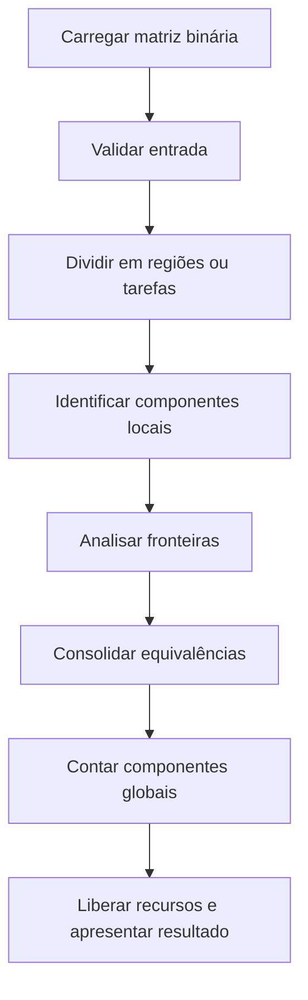
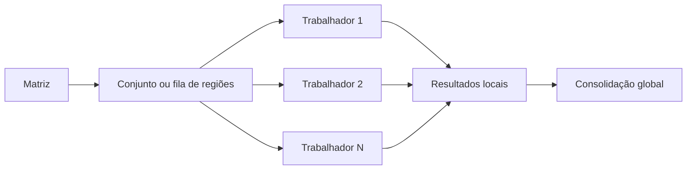

# Relatório técnico - Contagem paralela de objetos em uma matriz binária

> **Disciplina:** Sistemas Operacionais - 2026/II  
> **Professor:** Prof. Filipo Novo Mór  
> **Instituição:** Pontifícia Universidade Católica do Rio Grande do Sul - Escola Politécnica  
> **Repositório:** [URL pública do repositório](https://github.com/USUARIO/REPOSITORIO)  
> **Versão do relatório:** 1.0  
> **Data:** DD/MM/AAAA

<!--
INSTRUÇÕES DE USO DO MODELO

1. Substitua todos os campos marcados com [PREENCHER].
2. Remova estas instruções e todas as observações que não fizerem parte do relatório final.
3. Não invente resultados. Registre somente dados obtidos com a versão entregue.
4. Mantenha no repositório os dados brutos usados nas tabelas e nos gráficos.
5. Verifique se todos os links relativos funcionam na página do GitHub.
-->

## Identificação

| Campo | Informação |
|---|---|
| Integrante 1 | [PREENCHER nome completo] |
| Matrícula do integrante 1 | [PREENCHER] |
| Integrante 2 | [PREENCHER nome completo ou `Não se aplica`] |
| Matrícula do integrante 2 | [PREENCHER ou `Não se aplica`] |
| Modalidade | [Individual / dupla] |
| Turma | [PREENCHER] |
| Estratégia paralela | [Processos POSIX / Pthreads / híbrida] |
| Plataforma testada | [Linux / macOS] |
| Commit avaliado | [`HASH_DO_COMMIT`] |

## Resumo

[PREENCHER em um único parágrafo, entre 100 e 200 palavras: problema resolvido, estratégia da versão sequencial, estratégia da versão paralela, método de consolidação, principais resultados de correção e desempenho e conclusão.]

**Palavras-chave:** sistemas operacionais; paralelismo; processos; threads; conectividade 8; flood fill; componentes conexos.

## 1. Visão geral do problema

O programa recebe uma matriz binária na qual `0` representa o fundo e `1` representa o primeiro plano. Um objeto corresponde a um componente de células de valor `1` conectadas horizontalmente, verticalmente ou diagonalmente, conforme a **conectividade 8**.

O projeto contém duas implementações funcionalmente equivalentes:

1. uma versão sequencial, usada como referência de correção e de desempenho;
2. uma versão paralela baseada em [PREENCHER: processos POSIX, Pthreads ou solução híbrida].

### 1.1 Objetivos da implementação

- Contar corretamente os objetos com conectividade 8.
- Distribuir trabalho efetivo entre pelo menos duas unidades de execução.
- Reconhecer e unificar objetos que atravessam as divisões da matriz.
- Produzir resultados determinísticos e idênticos nas versões sequencial e paralela.
- Evitar condições de corrida, deadlocks, atualizações perdidas e contagens duplicadas.
- Avaliar correção, sobrecarga, escalabilidade, aceleração e eficiência.

### 1.2 Requisitos atendidos

| Requisito | Como foi atendido | Evidência no repositório |
|---|---|---|
| ANSI C C89/C90 | [PREENCHER] | [`src/...`](src/) |
| Conectividade 8 | [PREENCHER] | [arquivo/função/linhas] |
| Versão sequencial | [PREENCHER] | [`src/conta-objetos-sequencial.c`](src/conta-objetos-sequencial.c) |
| Versão paralela | [PREENCHER] | [`src/conta-objetos-paralelo.c`](src/conta-objetos-paralelo.c) |
| Duas ou mais unidades concorrentes | [PREENCHER] | [comando ou teste] |
| Quantidade configurável de trabalhadores | [PREENCHER] | [argumento/opção/configuração] |
| Consolidação entre regiões | [PREENCHER] | [arquivo/função/linhas] |
| Tratamento horizontal, vertical e diagonal | [PREENCHER] | [teste/evidência] |
| Verificação das chamadas POSIX | [PREENCHER] | [arquivo/função/linhas] |
| Liberação dos recursos | [PREENCHER] | [arquivo/função/linhas] |
| Compilação reproduzível | [PREENCHER] | [`Makefile`](Makefile) |

## 2. Organização do repositório

```text
.
├── README.md
├── RELATORIO_TECNICO.md
├── Makefile
├── src/
│   ├── conta-objetos-sequencial.c
│   └── conta-objetos-paralelo.c
├── tests/
│   ├── obrigatorios/
│   └── adicionais/
├── results/
│   ├── medicoes.csv
│   ├── grafico-tempo.png
│   ├── grafico-aceleracao.png
│   └── grafico-eficiencia.png
└── slides/
    └── apresentacao.pdf
```

<!-- Adapte a árvore à estrutura real. Não liste arquivos inexistentes. -->

| Caminho | Finalidade |
|---|---|
| `src/conta-objetos-sequencial.c` | Implementação sequencial de referência. |
| `src/conta-objetos-paralelo.c` | Implementação paralela. |
| `tests/obrigatorios/` | Cinco matrizes obrigatórias do enunciado. |
| `tests/adicionais/` | Matrizes maiores e casos adicionais criados pelo grupo. |
| `results/medicoes.csv` | Dados brutos das medições de desempenho. |
| `results/*.png` | Gráficos gerados a partir dos dados brutos. |
| `slides/apresentacao.pdf` | Slides utilizados na apresentação. |

## 3. Ambiente de desenvolvimento e execução

### 3.1 Hardware e software

| Item | Especificação |
|---|---|
| Processador | [PREENCHER modelo] |
| Núcleos físicos | [PREENCHER] |
| Processadores lógicos | [PREENCHER] |
| Memória RAM | [PREENCHER] |
| Sistema operacional | [PREENCHER distribuição/versão ou versão do macOS] |
| Arquitetura | [x86_64 / arm64 / outra] |
| Compilador | [PREENCHER nome e versão] |
| Padrão da linguagem | C89/C90 |
| APIs POSIX utilizadas | [PREENCHER] |
| Flags de compilação | `-std=c89 -Wall -Wextra -pedantic [PREENCHER]` |

### 3.2 Compilação

```bash
make clean
make
```

Ou, caso o projeto não use `make`:

```bash
cc -std=c89 -Wall -Wextra -pedantic src/conta-objetos-sequencial.c -o conta-objetos-sequencial
cc -std=c89 -Wall -Wextra -pedantic -pthread src/conta-objetos-paralelo.c -o conta-objetos-paralelo
```

<!-- Ajuste os comandos às dependências efetivamente usadas. -->

### 3.3 Execução

```bash
./conta-objetos-sequencial [PREENCHER ARGUMENTOS]
./conta-objetos-paralelo [PREENCHER ARGUMENTOS] [NUMERO_DE_TRABALHADORES]
```

**Exemplo reproduzível:**

```bash
[PREENCHER com um comando completo para executar uma matriz obrigatória em ambas as versões]
```

### 3.4 Formato da entrada e da saída

[PREENCHER: explique como a matriz é fornecida ao programa, como o número de trabalhadores é configurado e quais informações são exibidas. Inclua um exemplo curto de entrada e saída.]

## 4. Arquitetura da solução

### 4.1 Fluxo geral



<!-- Adapte o diagrama ao fluxo real da implementação. -->

### 4.2 Estruturas de dados principais

| Estrutura | Tipo/representação | Responsabilidade | Compartilhada? | Proteção utilizada |
|---|---|---|---|---|
| Matriz de entrada | [PREENCHER] | Armazenar `0` e `1` | [Sim/Não] | [PREENCHER/Não se aplica] |
| Células visitadas/rótulos | [PREENCHER] | Distinguir células processadas | [Sim/Não] | [PREENCHER] |
| Fila/pilha do flood fill | [PREENCHER] | Percorrer um componente | [Sim/Não] | [PREENCHER] |
| Tarefas/regiões | [PREENCHER] | Distribuir trabalho | [Sim/Não] | [PREENCHER] |
| Equivalências de rótulos | [PREENCHER] | Consolidar componentes | [Sim/Não] | [PREENCHER] |
| Resultados locais | [PREENCHER] | Armazenar contagens/rótulos parciais | [Sim/Não] | [PREENCHER] |

## 5. Implementação sequencial

### 5.1 Algoritmo

[PREENCHER: descreva o percurso da matriz, a criação da estrutura de visitados ou rótulos, o início de cada flood fill e a contagem final. Explique como os oito vizinhos são verificados.]

### 5.2 Pseudocódigo

```text
FUNÇÃO contar_objetos_sequencial(matriz):
    [PREENCHER]
```

### 5.3 Complexidade e uso de memória

| Aspecto | Análise | Justificativa |
|---|---|---|
| Complexidade de tempo | [PREENCHER] | [PREENCHER] |
| Complexidade de espaço | [PREENCHER] | [PREENCHER] |
| Risco de recursão excessiva | [Existe/Não existe] | [PREENCHER como foi evitado ou justificado] |

## 6. Implementação paralela

### 6.1 Modelo de concorrência

| Decisão | Escolha do grupo | Justificativa |
|---|---|---|
| Unidade de execução | [Processo/thread] | [PREENCHER] |
| Quantidade de trabalhadores | [PREENCHER como é configurada] | [PREENCHER] |
| Divisão do trabalho | [Linhas/colunas/blocos/fila dinâmica/outra] | [PREENCHER] |
| Escalonamento | [Estático/dinâmico] | [PREENCHER] |
| Comunicação | [Memória compartilhada/pipe/estruturas compartilhadas/outra] | [PREENCHER] |
| Sincronização | [Mutex/semaforo/variável de condição/outra] | [PREENCHER] |

### 6.2 Decomposição da matriz

[PREENCHER: explique como as dimensões das regiões são calculadas, como sobras são distribuídas e o que ocorre quando há mais regiões do que trabalhadores ou quando a matriz não é divisível igualmente.]



<!-- Se a estratégia não usa fila ou resultados locais, substitua o diagrama. -->

### 6.3 Paralelismo efetivo

[PREENCHER: identifique exatamente qual cálculo é executado simultaneamente. Explique por que a criação das unidades não é apenas concorrência aparente e como o trabalho é balanceado.]

| Etapa | Sequencial ou paralela? | Unidade responsável | Motivo |
|---|---|---|---|
| Leitura/geração da matriz | [PREENCHER] | [PREENCHER] | [PREENCHER] |
| Particionamento | [PREENCHER] | [PREENCHER] | [PREENCHER] |
| Identificação local | [PREENCHER] | [PREENCHER] | [PREENCHER] |
| Análise das fronteiras | [PREENCHER] | [PREENCHER] | [PREENCHER] |
| Consolidação | [PREENCHER] | [PREENCHER] | [PREENCHER] |
| Contagem final | [PREENCHER] | [PREENCHER] | [PREENCHER] |

### 6.4 Sincronização, comunicação e regiões críticas

| Recurso/dado | Risco concorrente | Mecanismo usado | Escopo da proteção | Justificativa |
|---|---|---|---|---|
| [PREENCHER] | [Condição de corrida/atualização perdida/outro] | [PREENCHER] | [PREENCHER] | [PREENCHER] |
| [PREENCHER] | [PREENCHER] | [PREENCHER] | [PREENCHER] | [PREENCHER] |

[PREENCHER: explique como a solução evita deadlock. Caso existam múltiplos bloqueios, informe a ordem de aquisição e liberação. Para processos, explique o mecanismo de IPC e a propriedade/liberação dos recursos.]

## 7. Consolidação dos componentes

Esta seção deve demonstrar por que a soma simples das contagens locais seria incorreta e como a solução reconhece que rótulos locais diferentes podem pertencer ao mesmo objeto global.

### 7.1 Identificação local

[PREENCHER: explique como cada componente local recebe um identificador e como identificadores de regiões diferentes permanecem distinguíveis antes da consolidação.]

### 7.2 Verificação das fronteiras

| Situação | Pares de células verificados | Como a equivalência é registrada |
|---|---|---|
| Fronteira horizontal | [PREENCHER] | [PREENCHER] |
| Fronteira vertical | [PREENCHER] | [PREENCHER] |
| Conexão diagonal | [PREENCHER] | [PREENCHER] |
| Encontro de quatro blocos | [PREENCHER] | [PREENCHER] |

### 7.3 Unificação e contagem global

[PREENCHER: descreva o algoritmo de equivalência/unificação empregado, o momento em que ele é executado, a sincronização necessária e como o número final de representantes distintos é calculado.]

### 7.4 Exemplo rastreável

[PREENCHER: escolha uma das matrizes obrigatórias que cruza fronteiras. Mostre os rótulos locais antes da consolidação, as equivalências encontradas e a contagem global depois da unificação. Inclua uma figura ou tabela.]

| Região | Rótulo local | Células de fronteira relevantes | Equivalência global |
|---|---|---|---|
| [PREENCHER] | [PREENCHER] | [PREENCHER] | [PREENCHER] |
| [PREENCHER] | [PREENCHER] | [PREENCHER] | [PREENCHER] |

## 8. Correção e testes funcionais

### 8.1 Procedimento de validação

[PREENCHER: explique como as saídas foram comparadas, se houve automatização, quais configurações paralelas foram testadas e como se verificou o determinismo.]

### 8.2 Matrizes obrigatórias

| Exemplo | Dimensões | Objetos esperados | Resultado sequencial | Resultado paralelo | Trabalhadores | Situação | Evidência |
|---:|---:|---:|---:|---:|---:|---|---|
| 1 | 5 x 5 | 3 | [PREENCHER] | [PREENCHER] | [PREENCHER] | [Aprovado/Falhou] | [link para log/teste] |
| 2 | 6 x 8 | 4 | [PREENCHER] | [PREENCHER] | [PREENCHER] | [Aprovado/Falhou] | [link para log/teste] |
| 3 | 8 x 8 | 5 | [PREENCHER] | [PREENCHER] | [PREENCHER] | [Aprovado/Falhou] | [link para log/teste] |
| 4 | 9 x 12 | 6 | [PREENCHER] | [PREENCHER] | [PREENCHER] | [Aprovado/Falhou] | [link para log/teste] |
| 5 | 12 x 12 | 7 | [PREENCHER] | [PREENCHER] | [PREENCHER] | [Aprovado/Falhou] | [link para log/teste] |

### 8.3 Casos de teste adicionais

| ID | Dimensões | Característica avaliada | Resultado de referência | Configurações paralelas | Resultado obtido | Situação |
|---|---:|---|---:|---|---:|---|
| A1 | [PREENCHER] | Matriz vazia ou somente zeros | [PREENCHER] | [PREENCHER] | [PREENCHER] | [PREENCHER] |
| A2 | [PREENCHER] | Um único objeto ocupando várias regiões | [PREENCHER] | [PREENCHER] | [PREENCHER] | [PREENCHER] |
| A3 | [PREENCHER] | Conexões somente diagonais | [PREENCHER] | [PREENCHER] | [PREENCHER] | [PREENCHER] |
| A4 | [PREENCHER] | Matriz grande usada no desempenho | [PREENCHER] | [PREENCHER] | [PREENCHER] | [PREENCHER] |
| A5 | [PREENCHER] | [Outro caso relevante] | [PREENCHER] | [PREENCHER] | [PREENCHER] | [PREENCHER] |

### 8.4 Repetibilidade e determinismo

| Teste | Repetições | Configurações | Resultados idênticos? | Observações |
|---|---:|---|---|---|
| [PREENCHER] | [PREENCHER] | [PREENCHER] | [Sim/Não] | [PREENCHER] |

## 9. Avaliação de desempenho

### 9.1 Metodologia experimental

| Parâmetro | Valor adotado |
|---|---|
| Matriz ou conjunto de matrizes | [PREENCHER dimensões, densidade e origem] |
| Mesmos dados em todas as versões? | [Sim/Não - justificar] |
| Relógio/API de medição | [Ex.: `clock_gettime(CLOCK_MONOTONIC, ...)`] |
| Trecho medido | [PREENCHER o que está incluído e excluído] |
| Aquecimentos descartados | [PREENCHER] |
| Repetições por configuração | [PREENCHER] |
| Medida representativa | [Média/mediana/outra] |
| Critério para dispersão | [Desvio-padrão/IQR/mínimo-máximo/outro] |
| Carga do sistema durante os testes | [PREENCHER] |
| Flags de otimização | [PREENCHER, por exemplo `-O2`] |

As medições brutas estão disponíveis em [`results/medicoes.csv`](results/medicoes.csv).

### 9.2 Métricas

A aceleração para `p` trabalhadores é calculada por:

$$
S(p) = \frac{T_{sequencial}}{T_{paralelo}(p)}
$$

A eficiência paralela é calculada por:

$$
E(p) = \frac{S(p)}{p}
$$

### 9.3 Resultados consolidados

| Versão | Trabalhadores (`p`) | Tempo representativo (ms) | Dispersão (ms) | Aceleração `S(p)` | Eficiência `E(p)` | Resultado correto? |
|---|---:|---:|---:|---:|---:|---|
| Sequencial | 1 | [PREENCHER] | [PREENCHER] | 1,00 | 1,00 | [Sim/Não] |
| Paralela | 2 | [PREENCHER] | [PREENCHER] | [PREENCHER] | [PREENCHER] | [Sim/Não] |
| Paralela | [PREENCHER] | [PREENCHER] | [PREENCHER] | [PREENCHER] | [PREENCHER] | [Sim/Não] |
| Paralela | [PREENCHER] | [PREENCHER] | [PREENCHER] | [PREENCHER] | [PREENCHER] | [Sim/Não] |

<!-- Inclua pelo menos duas quantidades diferentes de processos e/ou threads. -->

### 9.4 Dados brutos das repetições

| Versão | Trabalhadores | Repetição 1 (ms) | Repetição 2 (ms) | Repetição 3 (ms) | Repetição 4 (ms) | Repetição 5 (ms) | Medida representativa (ms) |
|---|---:|---:|---:|---:|---:|---:|---:|
| Sequencial | 1 | [PREENCHER] | [PREENCHER] | [PREENCHER] | [PREENCHER] | [PREENCHER] | [PREENCHER] |
| Paralela | 2 | [PREENCHER] | [PREENCHER] | [PREENCHER] | [PREENCHER] | [PREENCHER] | [PREENCHER] |
| Paralela | [PREENCHER] | [PREENCHER] | [PREENCHER] | [PREENCHER] | [PREENCHER] | [PREENCHER] | [PREENCHER] |

<!-- Acrescente ou remova colunas conforme o número real de repetições. -->

### 9.5 Gráfico de tempo de execução


**Figura 1 -** Tempo de execução da versão sequencial e das configurações paralelas. Barras de erro representam [PREENCHER]. Fonte: elaborado pelo grupo.

### 9.6 Gráfico de aceleração


**Figura 2 -** Aceleração observada em função da quantidade de trabalhadores. A linha ideal corresponde a `S(p) = p`. Fonte: elaborado pelo grupo.

### 9.7 Gráfico de eficiência


**Figura 3 -** Eficiência paralela em função da quantidade de trabalhadores. Fonte: elaborado pelo grupo.

<!--
Os três gráficos devem:
- possuir título, eixos identificados, unidades e legenda quando necessária;
- ser gerados a partir dos dados brutos versionados no repositório;
- usar a mesma unidade da tabela;
- permanecer legíveis na visualização do GitHub;
- evitar eixo truncado que distorça a comparação.
-->

### 9.8 Análise dos resultados

[PREENCHER: interprete os dados em vez de apenas repeti-los. Discuta, quando aplicável:]

- [ganho ou perda de desempenho em relação à versão sequencial];
- [efeito da quantidade de trabalhadores];
- [criação e finalização de processos/threads];
- [comunicação, sincronização e contenção];
- [granularidade das tarefas e balanceamento de carga];
- [custo da consolidação das fronteiras];
- [limitações de memória e cache];
- [razões para eventual `S(p) < 1` ou eficiência decrescente];
- [trechos que permanecem sequenciais].

## 10. Tratamento de erros e qualidade do código

### 10.1 Chamadas e recursos POSIX

| Chamada/recurso | Erro verificado? | Ação em caso de falha | Liberação/finalização |
|---|---|---|---|
| [Ex.: `pthread_create`] | [Sim/Não] | [PREENCHER] | [Ex.: `pthread_join`] |
| [Ex.: `fork`] | [Sim/Não/Não se aplica] | [PREENCHER] | [Ex.: `waitpid`] |
| [Ex.: mutex/semaforo] | [Sim/Não/Não se aplica] | [PREENCHER] | [PREENCHER] |
| Memória alocada | [Sim/Não] | [PREENCHER] | [Ex.: `free`] |

### 10.2 Compilação e análise

| Verificação | Comando/ferramenta | Resultado |
|---|---|---|
| Compilação C89/C90 | `make` ou [PREENCHER] | [Sem erros; avisos encontrados e tratados] |
| Avisos do compilador | `-Wall -Wextra -pedantic` | [PREENCHER] |
| Vazamentos de memória | [Valgrind/Leaks/sanitizer/outro] | [PREENCHER ou justificar não realização] |
| Condições de corrida | [ThreadSanitizer/Helgrind/testes/outro] | [PREENCHER ou justificar não realização] |

### 10.3 Separação de responsabilidades

[PREENCHER: explique como o código separa entrada, processamento, sincronização/comunicação, consolidação, medição e testes.]

## 11. Limitações e decisões de projeto

| Limitação ou decisão | Impacto | Alternativa considerada | Motivo da escolha |
|---|---|---|---|
| [PREENCHER] | [PREENCHER] | [PREENCHER] | [PREENCHER] |
| [PREENCHER] | [PREENCHER] | [PREENCHER] | [PREENCHER] |

## 12. Conclusão

[PREENCHER em dois ou três parágrafos: confirme se os objetivos foram alcançados; sintetize as evidências de correção; avalie o desempenho; indique o principal aprendizado sobre processos/threads, sincronização e consolidação; registre uma melhoria futura realista.]

## 13. Vídeo de apresentação

| Campo | Informação |
|---|---|
| Plataforma | [YouTube / Vimeo] |
| Link privado ou não listado | [INSERIR URL COMPLETA] |
| Duração | [MM:SS - máximo de 10 minutos] |
| Privacidade | [Não listado / privado compartilhado com o professor / protegido por senha] |
| Senha, se aplicável | [PREENCHER ou `Não se aplica`] |
| Data da última verificação do acesso | [DD/MM/AAAA] |

> **Importante:** o vídeo deve permanecer acessível ao professor durante todo o período de avaliação. No YouTube, um vídeo configurado como privado precisa ser explicitamente compartilhado com a conta indicada pelo professor; se essa conta não estiver disponível, use a opção **não listado**. No Vimeo, informe a senha no quadro acima quando houver proteção por senha. Teste o link em uma janela anônima antes da entrega.

### 13.1 Conteúdo do vídeo

- [ ] Problema e estratégia escolhida.
- [ ] Implementação sequencial e referência de correção.
- [ ] Decomposição, processos/threads e sincronização.
- [ ] Consolidação de objetos que atravessam regiões.
- [ ] Demonstração executável.
- [ ] Testes obrigatórios e adicionais.
- [ ] Resultados de desempenho.
- [ ] Conclusões.
- [ ] Participação de ambos os integrantes, quando o trabalho for em dupla.

## 14. Contribuições dos integrantes

<!-- Em trabalho individual, mantenha uma linha e indique 100%. -->

| Atividade | Integrante 1 | Integrante 2 | Evidência/observação |
|---|---|---|---|
| Projeto da solução sequencial | [PREENCHER] | [PREENCHER] | [PREENCHER] |
| Projeto da solução paralela | [PREENCHER] | [PREENCHER] | [PREENCHER] |
| Sincronização/comunicação | [PREENCHER] | [PREENCHER] | [PREENCHER] |
| Consolidação | [PREENCHER] | [PREENCHER] | [PREENCHER] |
| Testes e medições | [PREENCHER] | [PREENCHER] | [PREENCHER] |
| Documentação e apresentação | [PREENCHER] | [PREENCHER] | [PREENCHER] |

Todos os integrantes declaram compreender integralmente o código, as estruturas de dados, a divisão do trabalho, a sincronização, a comunicação, a consolidação e os resultados apresentados.

## 15. Ferramentas, bibliotecas, referências e códigos externos

| Recurso | Finalidade | Origem/link | Licença, quando aplicável | Partes do projeto afetadas |
|---|---|---|---|---|
| [PREENCHER] | [PREENCHER] | [PREENCHER] | [PREENCHER] | [PREENCHER] |

<!--
Identifique bibliotecas, artigos, documentação, exemplos, ferramentas de IA e trechos de código externos eventualmente utilizados. Explique como os resultados foram verificados e adaptados. Remova a linha vazia se nenhum recurso externo tiver sido usado e declare isso explicitamente.
-->

## 16. Checklist de entrega

### Código e execução

- [ ] O código segue ANSI C C89/C90.
- [ ] O projeto compila em Linux ou macOS.
- [ ] A compilação ocorre sem erros e os avisos foram tratados ou justificados.
- [ ] As principais chamadas POSIX têm os retornos verificados.
- [ ] Todos os recursos são finalizados ou liberados corretamente.
- [ ] A versão sequencial conta componentes com conectividade 8.
- [ ] A versão paralela distribui cálculo real entre pelo menos duas unidades.
- [ ] A quantidade de processos/threads é configurável.
- [ ] Conexões horizontais, verticais e diagonais são preservadas.
- [ ] Componentes que atravessam regiões são consolidados sem duplicidade.
- [ ] Não há condições de corrida, deadlocks ou atualizações perdidas conhecidas.

### Testes e desempenho

- [ ] As cinco matrizes obrigatórias foram executadas nas duas versões.
- [ ] A versão paralela produziu exatamente os mesmos resultados da sequencial.
- [ ] Foi criada pelo menos uma matriz maior para o teste de desempenho.
- [ ] Foram testadas pelo menos duas quantidades de processos/threads.
- [ ] As medições foram repetidas e o valor representativo foi explicado.
- [ ] Tempo sequencial, tempo paralelo, aceleração e eficiência foram informados.
- [ ] Resultados em que a versão paralela foi mais lenta foram explicados.
- [ ] Dados brutos, tabelas e gráficos estão versionados no repositório.

### Repositório e apresentação

- [ ] O repositório do GitHub está público.
- [ ] `README.md` contém descrição, autoria, compilação, execução e arquitetura.
- [ ] O `Makefile` ou as instruções equivalentes permitem compilação reproduzível.
- [ ] As matrizes de teste e seus resultados estão incluídos.
- [ ] A análise de desempenho está incluída.
- [ ] Os slides estão em `slides/apresentacao.pdf`.
- [ ] O link do vídeo está acessível e o vídeo tem até 10 minutos.
- [ ] Ferramentas, referências, bibliotecas e códigos externos foram identificados.
- [ ] O hash do commit avaliado foi registrado neste relatório.

## Apêndice A - Registro de comandos

```bash
# Informações do ambiente
[PREENCHER]

# Compilação
[PREENCHER]

# Execução dos testes obrigatórios
[PREENCHER]

# Execução dos testes de desempenho
[PREENCHER]
```

## Apêndice B - Formato sugerido dos dados brutos

O arquivo `results/medicoes.csv` pode adotar o seguinte cabeçalho:

```csv
matriz,linhas,colunas,versao,trabalhadores,repeticao,tempo_ms,objetos,resultado_correto
matriz_grande,10000,10000,sequencial,1,1,[PREENCHER],[PREENCHER],true
matriz_grande,10000,10000,paralela,2,1,[PREENCHER],[PREENCHER],true
```

## Apêndice C - Correspondência com os critérios de avaliação

| Critério | Peso | Seções com evidências |
|---|---:|---|
| Correção sequencial e paralela, incluindo conectividade 8 | 2,0 | 5, 6, 7 e 8 |
| Decomposição do problema e paralelismo efetivo | 1,5 | 6.1, 6.2 e 6.3 |
| Sincronização, comunicação e ausência de condições de corrida | 1,5 | 6.4 e 10 |
| Consolidação de objetos que atravessam regiões | 1,5 | 7 |
| Testes obrigatórios, adicionais e análise de desempenho | 1,0 | 8 e 9 |
| Qualidade do código ANSI C e tratamento de erros | 1,0 | 3 e 10 |
| Organização do repositório e documentação | 0,5 | 2, 3 e 16 |
| Apresentação, demonstração e domínio da implementação | 1,0 | 13 e 14 |
